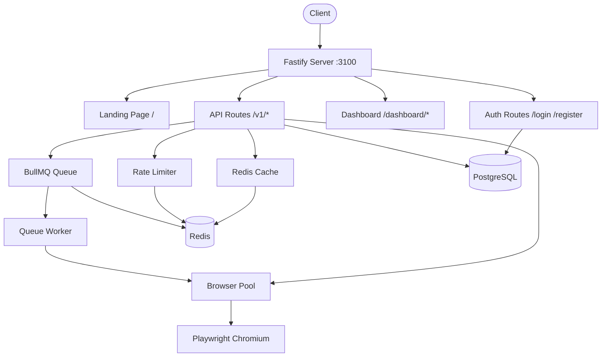

# ScreenForge

[](https://github.com/hodlthedoor/screenforge/actions/workflows/ci.yml)
[](LICENSE)
[](docker-compose.yml)

**Self-hostable screenshot, PDF, and OG image API.** Open-source alternative to ScreenshotOne, Urlbox, and similar services.

---

## Quick Start

```bash
git clone https://github.com/hodlthedoor/screenforge.git
cd screenforge
cp .env.example .env
# Generate required secrets:
#   openssl rand -hex 32   -> API_KEY_SALT
#   openssl rand -hex 32   -> SESSION_SECRET
docker compose up -d
```

The API is available at `http://localhost:3100`, Swagger docs at `http://localhost:3100/docs`, and the dashboard at `http://localhost:3100/dashboard`.

---

## Features

- **Screenshots** -- full page, viewport, or element-level capture in PNG/JPEG/WebP with custom dimensions, dark mode, device scale factor, and delay
- **PDF generation** -- render any URL to PDF with A4/Letter/Legal page formats, margins, landscape mode, and custom header/footer templates
- **OG card generation** -- auto-generate Open Graph preview images with built-in templates and light/dark themes
- **Pre-capture actions** *(v1.2.0)* -- automate click, scroll, type, hover, wait, delay actions before capture for interactive pages
- **Element hiding/removal** *(v1.2.0)* -- hide or remove DOM elements via CSS selectors before rendering
- **Element blurring** *(v1.2.0)* -- blur sensitive content with configurable radius for privacy-safe screenshots
- **Content validation** *(v1.2.0)* -- fail renders if specific text is present or missing from the page
- **Ad blocking** *(v1.2.0)* -- block 40+ ad/tracker domains for cleaner screenshots
- **Batch rendering** -- submit up to 50 mixed render jobs (screenshot, PDF, OG) in a single request
- **Async rendering** -- queue any render job and poll for results, ideal for long-running captures
- **Signed URLs** -- generate HMAC-signed GET URLs for screenshots and PDFs, perfect for embedding in HTML without exposing API keys
- **Webhooks** -- receive async render notifications via callback URLs with delivery tracking and retry
- **Content-hash caching** -- deduplicate identical renders with configurable TTL, saving compute and bandwidth
- **Browser pool** -- managed pool of Playwright Chromium instances with automatic recycling for stability
- **API key authentication** -- tier-based access control with sliding-window rate limiting per key
- **Job queue** -- BullMQ-powered async rendering with Redis-backed persistence and automatic retries
- **Stripe billing** -- integrated checkout, customer portal, and webhook handling for paid tiers
- **Transactional email** -- SMTP-based email for verification, password reset, billing receipts, and usage alerts
- **Dashboard** -- web UI to manage API keys, view usage charts, and configure account settings
- **Prometheus metrics** -- `/metrics` endpoint for Grafana dashboards and alerting
- **Swagger docs** -- interactive API documentation at `/docs`
- **SSRF protection** -- private/internal URL blocking enabled by default
- **Docker-ready** -- single `docker compose up` with PostgreSQL, Redis, and Chromium included

---

## API Reference

### Endpoints

| Method | Path | Auth | Description |
|--------|------|------|-------------|
| `POST` | `/v1/screenshot` | API key | Take a screenshot |
| `POST` | `/v1/pdf` | API key | Generate a PDF |
| `POST` | `/v1/og` | API key | Generate OG card |
| `POST` | `/v1/batch` | API key | Batch render (up to 50) |
| `GET` | `/v1/batch/:id` | API key | Poll batch status |
| `GET` | `/v1/render/:id` | None | Poll async job |
| `GET` | `/v1/signed/screenshot` | Signature | Signed URL screenshot |
| `GET` | `/v1/signed/pdf` | Signature | Signed URL PDF |
| `POST` | `/v1/keys` | Admin | Create API key |
| `GET` | `/v1/keys` | Admin | List API keys |
| `GET` | `/v1/usage` | API key | Get usage stats |
| `GET` | `/v1/webhooks/deliveries` | API key | List webhook deliveries |
| `GET` | `/v1/webhooks/deliveries/:id` | API key | Get delivery detail |
| `POST` | `/v1/webhooks/test` | API key | Send test webhook |
| `POST` | `/v1/billing/checkout` | Session | Create checkout session |
| `GET` | `/v1/billing/portal` | Session | Stripe portal redirect |
| `POST` | `/v1/billing/webhook` | Stripe sig | Stripe webhook |
| `GET` | `/v1/health` | None | Detailed health check |
| `GET` | `/v1/analytics` | API key | Render analytics & history |
| `GET` | `/v1/errors` | None | Error code reference |
| `GET` | `/health` | None | Simple health check |
| `GET` | `/docs` | None | Swagger UI |

All render endpoints accept `?async=true` to queue the job and return a `jobId` for polling.

### curl Examples

#### Screenshot

```bash
curl -X POST http://localhost:3100/v1/screenshot \
  -H "Authorization: Bearer sf_live_..." \
  -H "Content-Type: application/json" \
  -d '{
    "url": "https://example.com",
    "format": "png",
    "width": 1920,
    "height": 1080,
    "fullPage": true,
    "darkMode": true,
    "deviceScaleFactor": 2
  }' \
  --output screenshot.png
```

#### PDF

```bash
curl -X POST http://localhost:3100/v1/pdf \
  -H "Authorization: Bearer sf_live_..." \
  -H "Content-Type: application/json" \
  -d '{
    "url": "https://example.com",
    "format": "A4",
    "landscape": false,
    "margin": { "top": "1cm", "bottom": "1cm" }
  }' \
  --output page.pdf
```

#### OG Card

```bash
curl -X POST http://localhost:3100/v1/og \
  -H "Authorization: Bearer sf_live_..." \
  -H "Content-Type: application/json" \
  -d '{
    "url": "https://example.com",
    "title": "My Page Title",
    "template": "article",
    "theme": "dark"
  }' \
  --output og.png
```

#### Batch Render

```bash
curl -X POST http://localhost:3100/v1/batch \
  -H "Authorization: Bearer sf_live_..." \
  -H "Content-Type: application/json" \
  -d '{
    "items": [
      { "type": "screenshot", "url": "https://example.com" },
      { "type": "pdf", "url": "https://example.com/docs" },
      { "type": "og", "url": "https://example.com/blog/post-1" }
    ]
  }'
# Returns: { "batchId": "...", "items": [...] }

# Poll batch status
curl http://localhost:3100/v1/batch/BATCH_ID \
  -H "Authorization: Bearer sf_live_..."
```

#### Async Rendering

```bash
# Queue a screenshot
curl -X POST "http://localhost:3100/v1/screenshot?async=true" \
  -H "Authorization: Bearer sf_live_..." \
  -H "Content-Type: application/json" \
  -d '{"url": "https://example.com"}'
# Returns: { "jobId": "abc123", "pollUrl": "/v1/render/abc123" }

# Poll for result
curl http://localhost:3100/v1/render/abc123
# Returns: { "status": "completed", "url": "/storage/abc123.png" }
```

#### Signed URLs

Signed URLs allow GET-based rendering without exposing API keys -- ideal for `` tags and CDN integration.

```bash
curl "http://localhost:3100/v1/signed/screenshot?url=https://example.com&width=1280&signature=HMAC_SIG&expires=1700000000" \
  --output screenshot.png

curl "http://localhost:3100/v1/signed/pdf?url=https://example.com&format=A4&signature=HMAC_SIG&expires=1700000000" \
  --output page.pdf
```

#### Advanced Capture Controls (v1.2.0)

ScreenForge supports powerful pre-capture interactions, element filtering, content validation, and ad blocking:

**Pre-capture actions** -- automate interactions before screenshot/PDF capture:

```bash
curl -X POST http://localhost:3100/v1/screenshot \
  -H "Authorization: Bearer sf_live_..." \
  -H "Content-Type: application/json" \
  -d '{
    "url": "https://example.com",
    "actions": [
      {"type": "click", "selector": "#accept-cookies"},
      {"type": "wait", "duration": 500},
      {"type": "scroll", "x": 0, "y": 500},
      {"type": "type", "selector": "#search", "text": "Hello"}
    ]
  }' \
  --output interactive.png
```

Actions are executed in order before capture. Supported types: `click`, `scroll`, `type`, `hover`, `wait`, `delay`.

**Element hiding and removal** -- hide or remove elements from the DOM:

```bash
curl -X POST http://localhost:3100/v1/screenshot \
  -H "Authorization: Bearer sf_live_..." \
  -H "Content-Type: application/json" \
  -d '{
    "url": "https://example.com",
    "hide_selectors": [".sidebar", ".footer"],
    "remove_selectors": ["#popup-banner"]
  }' \
  --output clean.png
```

- `hide_selectors`: elements hidden with CSS (`visibility: hidden`)
- `remove_selectors`: elements removed from DOM entirely

**Element blurring** -- blur sensitive content:

```bash
curl -X POST http://localhost:3100/v1/screenshot \
  -H "Authorization: Bearer sf_live_..." \
  -H "Content-Type: application/json" \
  -d '{
    "url": "https://example.com/dashboard",
    "blur_selectors": [".email", ".phone", ".ssn"],
    "blur_radius": 20
  }' \
  --output blurred.png
```

**Content validation** -- fail capture if conditions aren't met:

```bash
curl -X POST http://localhost:3100/v1/screenshot \
  -H "Authorization: Bearer sf_live_..." \
  -H "Content-Type: application/json" \
  -d '{
    "url": "https://example.com",
    "fail_if_contains": "Error 404",
    "fail_if_missing": "Welcome"
  }'
# Returns 400 if "Error 404" is found or "Welcome" is missing
```

**Ad blocking** -- block ads, trackers, and analytics:

```bash
curl -X POST http://localhost:3100/v1/screenshot \
  -H "Authorization: Bearer sf_live_..." \
  -H "Content-Type: application/json" \
  -d '{
    "url": "https://example.com",
    "block_ads": true
  }' \
  --output no-ads.png
```

Blocks 40+ ad domains including Google Ads, Doubleclick, Amazon Ads, and common trackers.

---

## SDKs

### Installation

**JavaScript/TypeScript:**
```bash
npm install @screenforge/sdk
```

**Python:**
```bash
pip install screenforge
```

### JavaScript SDK

A typed JavaScript/TypeScript SDK is available in [`sdk/js/`](sdk/js/).

```ts
import { ScreenForge } from '@screenforge/sdk';

const client = new ScreenForge({
  apiKey: 'sf_live_...',
  baseUrl: 'https://api.screenforge.dev',
});

// Screenshot
const png = await client.screenshot('https://example.com', { fullPage: true });

// PDF
const pdf = await client.pdf('https://example.com', { format: 'a4' });

// OG Card
const og = await client.og('https://example.com', { theme: 'dark' });

// Async
const job = await client.screenshotAsync('https://example.com');
const result = await client.pollJob(job.jobId);

// Batch
const batch = await client.batchRender([
  { type: 'screenshot', url: 'https://example.com' },
  { type: 'pdf', url: 'https://example.com' },
]);

// Webhooks
const deliveries = await client.listWebhookDeliveries({ page: 1, limit: 10 });

// Usage
const usage = await client.getUsage();
```

### Python SDK

A typed Python SDK with both sync and async support is available in [`sdk/python/`](sdk/python/).

```python
from screenforge import ScreenForgeClient

client = ScreenForgeClient(
    api_key='sf_live_...',
    base_url='https://api.screenforge.dev'
)

# Screenshot
png_bytes = client.screenshot('https://example.com', {'fullPage': True})

# PDF
pdf_bytes = client.pdf('https://example.com', {'format': 'a4'})

# OG Card
og_bytes = client.og('https://example.com', {'theme': 'dark'})

# Async
from screenforge import AsyncScreenForgeClient

async_client = AsyncScreenForgeClient(api_key='sf_live_...', base_url='https://api.screenforge.dev')
result = await async_client.screenshot('https://example.com')
```

---

## Pricing Tiers

| Tier | Renders/month | Rate Limit | Price |
|----------|--------------|--------------|---------|
| Free | 100 | 10 req/min | $0 |
| Starter | 5,000 | 50 req/min | $29/mo |
| Pro | 25,000 | 200 req/min | $79/mo |
| Business | Unlimited | 1,000 req/min | $199/mo |

Billing is handled via Stripe. Self-hosted instances can define custom tiers or disable billing entirely.

---

## Configuration

All configuration is done via environment variables. Copy `.env.example` to `.env` and adjust as needed.

| Variable | Type | Default | Description |
|----------|------|---------|-------------|
| `PORT` | number | `3100` | Server port |
| `BASE_URL` | string | `http://localhost:3100` | Base URL for async poll URLs and redirects |
| `NODE_ENV` | string | `production` | Environment (`development`, `production`, `test`) |
| `DATABASE_URL` | string | **required** | PostgreSQL connection string |
| `REDIS_URL` | string | `redis://redis:6379/0` | Redis connection string |
| `API_KEY_SALT` | string | **required** | Salt for API key hashing (min 16 chars) |
| `SESSION_SECRET` | string | **required** | Session cookie secret (min 32 chars) |
| `ADMIN_API_KEY` | string | -- | Admin API key for `/v1/keys` management |
| `REQUIRE_AUTH` | boolean | `false` | Require API key for render endpoints |
| `ALLOW_PRIVATE_URLS` | boolean | `false` | Allow rendering of private/internal URLs |
| `STORAGE_PATH` | string | `./storage` | Directory for rendered files |
| `BROWSER_POOL_SIZE` | number | `3` | Playwright browser instances (1-20) |
| `MAX_RENDERS_PER_CONTEXT` | number | `100` | Recycle browser context after N renders |
| `CACHE_TTL_SECONDS` | number | `3600` | Cache duration in seconds (0 = disabled) |
| `NAVIGATION_TIMEOUT_MS` | number | `30000` | Page navigation timeout in ms |
| `MAX_CONTENT_SIZE_MB` | number | `50` | Max request body size in MB |
| `METRICS_ENABLED` | boolean | `true` | Enable Prometheus `/metrics` endpoint |
| `STRIPE_SECRET_KEY` | string | -- | Stripe secret key (`sk_test_...` or `sk_live_...`) |
| `STRIPE_PUBLISHABLE_KEY` | string | -- | Stripe publishable key (`pk_test_...` or `pk_live_...`) |
| `STRIPE_WEBHOOK_SECRET` | string | -- | Stripe webhook signing secret (`whsec_...`) |
| `SMTP_HOST` | string | -- | SMTP server hostname |
| `SMTP_PORT` | number | `587` | SMTP port (587 for TLS, 465 for SSL) |
| `SMTP_USER` | string | -- | SMTP username |
| `SMTP_PASS` | string | -- | SMTP password or API key |
| `SMTP_FROM` | string | `noreply@screenforge.dev` | From address for outgoing emails |

Generate secrets with:

```bash
openssl rand -hex 32
```

---

## Self-Hosting Guide

### Docker Compose (Recommended)

The easiest way to run ScreenForge. Docker Compose starts the API server, PostgreSQL, and Redis with persistent volumes.

```bash
# 1. Clone and enter the project
git clone https://github.com/hodlthedoor/screenforge.git
cd screenforge

# 2. Create and configure .env
cp .env.example .env
# Set API_KEY_SALT and SESSION_SECRET (required):
#   openssl rand -hex 32

# 3. Start all services
docker compose up -d

# 4. Verify
curl http://localhost:3100/health
# {"status":"ok"}
```

Data is persisted in Docker volumes (`pgdata`, `redisdata`, `storage`). To upgrade, pull the latest image and restart:

```bash
docker compose pull && docker compose up -d
```

### Bare Metal

Prerequisites:
- Node.js 22+
- PostgreSQL 16+
- Redis 7+

```bash
# 1. Clone and install
git clone https://github.com/hodlthedoor/screenforge.git
cd screenforge
npm install --include=dev

# 2. Install Playwright browsers
npx playwright install chromium

# 3. Create the database
createdb screenforge

# 4. Run migrations (in order)
for f in sql/*.sql; do psql screenforge < "$f"; done

# 5. Configure environment
cp .env.example .env
# Edit .env: set DATABASE_URL, API_KEY_SALT, SESSION_SECRET
# For peer auth: DATABASE_URL=postgresql:///screenforge?host=/var/run/postgresql

# 6. Build and start
npm run build
npm start
```

Use a process manager like pm2 for production:

```bash
npm install -g pm2
pm2 start dist/index.js --name screenforge
pm2 save
```

### Production Deployment with SSL

ScreenForge includes production-ready nginx configuration with SSL, rate limiting, and security headers.

#### Self-Signed Certificates (Internal/Development)

The repository includes `nginx-screenforge.conf` configured with self-signed certificates:

```bash
# 1. Deploy nginx configuration
sudo bash deploy-nginx.sh

# 2. Add domain to /etc/hosts (use your server's IP)
echo "YOUR_SERVER_IP screenforge.local" | sudo tee -a /etc/hosts

# 3. Reload nginx
sudo nginx -t && sudo systemctl reload nginx

# 4. Restart pm2 if running
pm2 restart screenforge
```

Access ScreenForge at `https://screenforge.local` (browsers will warn about self-signed cert; this is expected).

#### Let's Encrypt SSL (Public Domain)

For production with a public domain:

```bash
# 1. Update nginx-screenforge.conf server_name to your domain
sed -i 's/screenforge.local/yourdomain.com/g' nginx-screenforge.conf

# 2. Deploy nginx config
sudo bash deploy-nginx.sh

# 3. Install certbot and obtain SSL certificate
sudo apt install certbot python3-certbot-nginx
sudo certbot --nginx -d yourdomain.com

# 4. Update BASE_URL in both .env and ecosystem.config.cjs
sed -i 's|https://screenforge.local|https://yourdomain.com|' .env
sed -i 's|https://screenforge.local|https://yourdomain.com|' ecosystem.config.cjs

# 5. Reload nginx and restart pm2
sudo systemctl reload nginx
pm2 restart screenforge
```

The nginx config includes:
- HTTP → HTTPS redirect (301)
- Rate limiting (10 req/s per IP, burst 20)
- Security headers (HSTS, X-Frame-Options, CSP-ready)
- Gzip compression
- 120s timeout for long renders

---

## Monitoring

ScreenForge exposes Prometheus metrics at `/metrics` and includes pre-configured Grafana dashboards for comprehensive observability.

### Quick Start

Start ScreenForge with monitoring enabled using Docker Compose profiles:

```bash
docker compose --profile monitoring up -d
```

This starts:
- **ScreenForge** at `http://localhost:3100`
- **Prometheus** at `http://localhost:9090`
- **Grafana** at `http://localhost:3000`

### Access Grafana

1. Open `http://localhost:3000`
2. Login with default credentials:
   - Username: `admin`
   - Password: `admin`
   - **⚠️ Production:** Change credentials via `GRAFANA_ADMIN_USER` and `GRAFANA_ADMIN_PASSWORD` in `.env`
3. The ScreenForge dashboard is auto-provisioned and ready to use

### Dashboard Panels

The pre-built dashboard includes:

- **Request Rate by Endpoint** — requests/sec grouped by API route
- **Request Rate by Status Code** — HTTP status code distribution
- **Render Duration (p50/p95/p99)** — screenshot/PDF generation latency percentiles
- **Browser Pool Utilization** — percentage of browser contexts in use
- **Queue Depth** — waiting/active/completed/failed job counts
- **Cache Hit Rate** — percentage of renders served from cache
- **Storage Disk Usage** — total cached file size
- **Cache Entries** — number of cached renders
- **Rate Limit Rejections** — 429 response count
- **Error Rate by Type** — failed render breakdown
- **Active HTTP Connections** — Node.js TCP/TLS handle count

### Metrics Endpoint

The `/metrics` endpoint is enabled by default and can be scraped by any Prometheus-compatible monitoring system:

```bash
curl http://localhost:3100/metrics
```

To disable metrics, set `METRICS_ENABLED=false` in your `.env` file.

### Custom Prometheus Configuration

Edit `prometheus.yml` to adjust scrape intervals or add additional targets. Restart Prometheus after changes:

```bash
docker compose --profile monitoring restart prometheus
```

---

## Architecture



---

## Development

```bash
npm run dev          # Start with hot reload (tsx watch)
npm test             # Run test suite (Vitest)
npm run lint         # Lint check (ESLint)
npm run typecheck    # Type check (tsc --noEmit)
npm run build        # Compile TypeScript to dist/
```

Database migrations are in `sql/` and run automatically on first boot in Docker. For bare metal, apply them manually with `psql`.

---

## Contributing

See [CONTRIBUTING.md](CONTRIBUTING.md) for the full guide. Quick summary:

1. Fork the repository
2. Create a feature branch (`git checkout -b feat/my-feature`)
3. Write tests first, then implement (TDD)
4. Ensure all checks pass: `npm test && npm run lint && npm run typecheck`
5. Commit using [Conventional Commits](https://www.conventionalcommits.org/) (`feat:`, `fix:`, `refactor:`, etc.)
6. Open a pull request against `main`

### Code Standards

- TypeScript strict mode, no `any`
- Single responsibility per file/function
- Keep files small and focused
- Zod for all input validation
- Tests required for new features and bug fixes

---

## Tech Stack

- **Runtime**: Node.js 22 + TypeScript (strict mode)
- **Framework**: Fastify 5
- **Browser**: Playwright (Chromium)
- **Queue**: BullMQ + Redis
- **Database**: PostgreSQL 16
- **Validation**: Zod
- **Auth**: bcrypt + cookie sessions + API key tiers
- **Billing**: Stripe (Checkout + Customer Portal)
- **Email**: Nodemailer (SMTP)
- **Metrics**: prom-client (Prometheus)
- **Docs**: @fastify/swagger + Swagger UI
- **Testing**: Vitest
- **Containerization**: Docker + Docker Compose

---

## License

[MIT](LICENSE)
